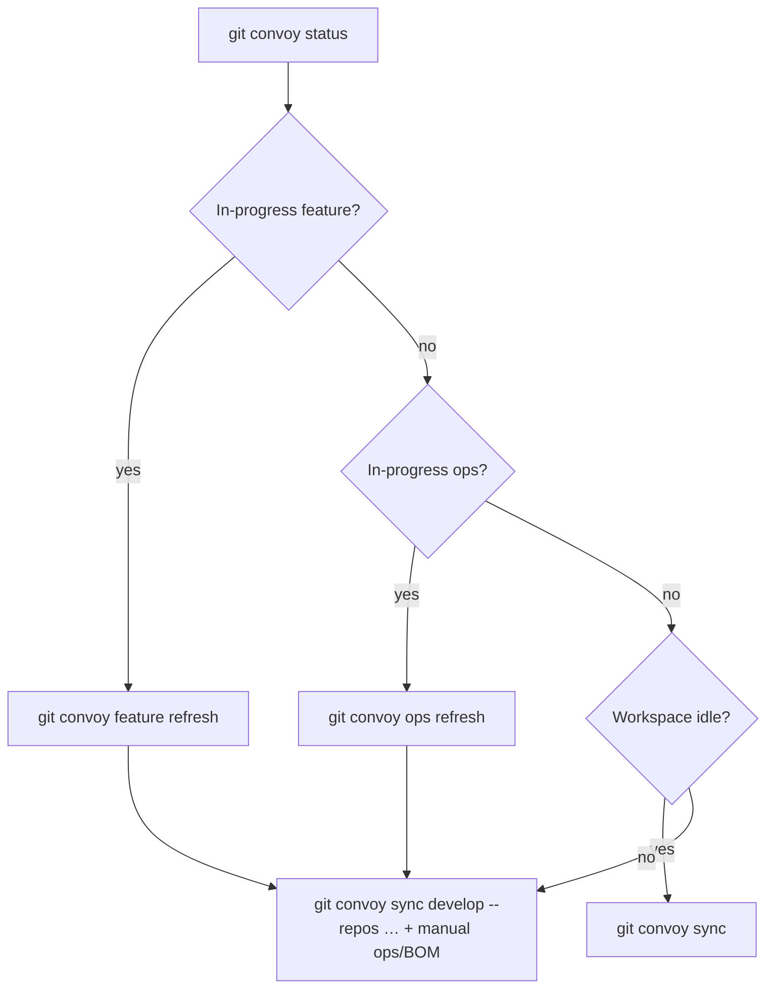

# Workspace sync manual

How to keep every clone in a Renglo workspace current with GitHub — **without** requiring a perfectly idle machine. Use this when you come back after a few days, when other projects merge features while you work, or when you see “divergent branches” / “ahead and behind” on `develop`.

**Tooling:** [git-convoy](README.md) (`git convoy …`). **Process authority:** [cross-repo-feature-manual.md](cross-repo-feature-manual.md).

Always start with:

```bash
git convoy status
git convoy --json status    # agents / scripts
```

---

## Branches and repo kinds


| Kind        | Examples                                                           | Integration branch | Production branch   | How code lands on production                                    |
| ----------- | ------------------------------------------------------------------ | ------------------ | ------------------- | --------------------------------------------------------------- |
| **Product** | `renglo-lib`, `renglo-api`, `console`, `extensions/*`              | `develop`          | `main` (stable tag) | Release train only                                              |
| **Ops**     | `launcher`, `bom-helper`, `git-convoy`, `renglo-cli`, `bootstrap`, `publisher` | `develop` | `main` (relaxed)    | `ops/<name>` PR → `develop`; platform release manager graduates `develop` → `main` + tag |
| **BOM**     | `*-bom`                                                            | —                  | `main` only         | Release manager writes pins on `main`; **that push deploys**    |


**Golden rules**

1. **Product feature work never commits on** `develop`**.** Edit on `develop` if you must, then `git convoy feature adopt` so commits live on `feature/<name>`.
2. **Do not** `git pull` **on** `main` **to “get latest” for daily product work.** Use `develop` and the sync commands below.
3. **Do not re-implement a merged PR on a parallel local branch.** If GitHub already has the work on `origin/develop`, merge or reset — do not build it again on local `develop`.
4. **BOM repos:** pull `main` to read current pins; only release managers commit/push.

---


## Which command when


| Your situation                                             | Command                                        | Idle workspace required? |
| ---------------------------------------------------------- | ---------------------------------------------- | ------------------------ |
| Between features / starting something new                  | `git convoy sync`                              | **Yes**                  |
| Product feature in progress                                | `git convoy feature refresh`                   | No (participants only)   |
| Ops tooling change in progress                             | `git convoy ops refresh`                       | No (participants only)   |
| `develop` behind stable `main` (one or more product repos) | `git convoy sync develop`                      | No                       |
| Same, scoped                                               | `git convoy sync develop --repos console,data` | No                       |
| After hotfix publish (feature branches need the patch)     | `git convoy feature refresh`                   | No                       |
| BOM pins (read-only)                                       | `git checkout main && git pull` in `*-bom`     | Per-repo clean `main`    |
| Ops repo not on current ops sheet                          | Manual pull on `develop` (see §5)              | —                        |





---


## 1. Full workspace catch-up (`git convoy sync`)

Use when you are **between** features, trains, hotfixes, and ops sheets — ready to land on a clean integration branch everywhere.

```bash
git convoy sync
git convoy sync --no-push    # local only; do not push develop
```

**What it does (every clone):**

- **Product:** fetch → checkout `develop` → fast-forward `origin/develop` → merge latest stable tag (or `origin/main`) → optionally push `develop`.
- **Aux:** fetch → checkout `develop` → fast-forward `origin/develop` only; merge a stable `v*` tag into `develop` only when that tag is not yet an ancestor (hotfix landed on `main`) → optionally push `develop`. Raw `origin/main` is **not** merged during sync.
- **BOM:** fetch → checkout `main` → fast-forward `origin/main`.

**When it refuses (and what to do instead):**


| Blocker                                    | Meaning                         | Next step                                                 |
| ------------------------------------------ | ------------------------------- | --------------------------------------------------------- |
| `dirty: …`                                 | Uncommitted files               | `feature commit` / `ops commit` / stash                   |
| `feature X is in-progress`                 | Open feature sheet              | `feature refresh`, or `feature close` / `feature abandon` |
| `ops X is in-progress`                     | Open ops sheet                  | `ops refresh`, or `ops close` / `ops abandon`             |
| `hotfix X is …`                            | Open hotfix                     | Finish or `hotfix abandon`                                |
| `train X is cut/stabilizing`               | Active train                    | Finish train workflow or `train delete --yes`             |
| `on feature/… with commits not in develop` | Leftover topic branch           | Merge PR, `feature close`, or checkout `develop`          |
| `develop diverged from origin/develop`     | Local vs remote split           | §4 — merge or reset, do not duplicate work                |
| `local commits on develop not on origin`   | Committed on develop by mistake | `feature adopt`, or reset develop to `origin/develop`     |


You do **not** need a clean slate to run `git convoy sync develop` (§3). You **do** need a clean slate for bare `git convoy sync`.

---


## 2. Stay current **while** a feature is open

You are on `feature/<name>` in some product repos. Other people merge to `origin/develop` every day.

### Step A — refresh participants

```bash
git convoy feature refresh
```

For each repo on the **feature sheet:** checkout `feature/<name>`, fetch, merge `origin/develop`. On conflict: resolve on the feature branch, then run refresh again.

Uncommitted files in a participant repo can block the merge — commit or stash in that repo first.

### Step B — heal repos you are **not** touching

Product repos **not** on the feature sheet can still fall behind stable `main`:

```bash
git convoy sync develop --repos renglo-lib,console
git convoy sync develop --no-push    # local only
```

This checks out `develop` in those repos only. Each repo’s `develop` must be **clean** (no uncommitted files on `develop`).

### Step C — ops and BOM while on a product feature

- **Ops** (`launcher`, `bom-helper`, …): not updated by `sync develop`. Either manual §5, or if you have an ops sheet open, `git convoy ops refresh`.
- **BOM:** `git -C ops/<tenant>-bom pull origin main` (read pins only unless you are the release manager).

---


## 3. Heal `develop` from stable `main` (`git convoy sync develop`)

Use when `develop` is behind tagged `main` — repo sat out of the last train, new extension, post-hotfix drift — **without** resetting the whole workspace.

```bash
git convoy sync develop
git convoy sync develop --repos data,console
git convoy sync develop --no-push
```

Same merge logic as the automatic step inside `feature prs`, `train tag-rc`, and `train mergeback`. Continues past per-repo failures; re-run after fixing conflicts.

**Scope:** **product repos only** (not ops, not BOM). For ops tooling, use §5 or `ops refresh`.

Per-repo requirements:

- `develop` must be clean (commit/stash first).
- On conflict: merge is **aborted**; repo left clean. Fix on `develop`, re-run.

---


## 4. Divergent branches (avoid duplicating work)

This is the failure mode that produces “same feature implemented twice” — e.g. a PR merged on GitHub while local `develop` had a parallel commit.

**Symptoms:** `git status` shows `ahead N, behind M` on `develop`, or `git convoy sync` reports `develop diverged from origin/develop`.

**Diagnose:**

```bash
git -C dev/renglo-lib log --oneline --left-right develop...origin/develop
```

**Fix (pick one):**


| Case                                                        | Action                                                                                          |
| ----------------------------------------------------------- | ----------------------------------------------------------------------------------------------- |
| Local commits are **the same work** as the merged PR        | Reset: `git checkout develop && git reset --hard origin/develop`                                |
| Local commits are **legit** and remote has **other** merges | Merge: `git checkout develop && git fetch && git merge origin/develop` (resolve conflicts once) |
| You were doing feature work on `develop`                    | After merge/reset: `git convoy feature adopt` so work moves to `feature/<name>`                 |


**Prevention:**

1. Before starting cross-repo work, run `git fetch` in every repo you will touch and ensure `develop` is not behind/diverged from `origin/develop`.
2. If a teammate’s PR already merged, **pull that** — never re-cut the same change on local `develop`.
3. For ops repos (`bom-helper`, `launcher`, `git-convoy`), same rule on `develop` vs `origin/develop`. Day-to-day ops work lands on `develop`; if you use an `ops/<name>` branch, run `ops refresh` to merge `origin/develop` into it.

---


## 5. Ops repos (develop-first, no git-convoy required)

**Neutral branch is `develop`.** You do not need `main` for daily ops work. The manual flow without git-convoy:

```bash
cd ops/launcher   # or bom-helper, git-convoy, renglo-cli, bootstrap, …
git fetch origin --tags --prune
git checkout develop
git merge --ff-only origin/develop
# optional: if a hotfix tag landed on main and is not in develop yet:
git merge v1.2.3    # only when that tag exists and develop lacks it
```

**Small change on a branch (preferred):**

```bash
git checkout develop && git pull origin develop
git checkout -b ops/my-change
# edit, commit, push, open PR: ops/my-change → develop
```

**Direct commit to develop (legal, not ideal):** edit on `develop`, commit, `git push origin develop`.

**Platform release (infrequent):** `git convoy ops release <repo>` — bump, develop→main PR, or tag as needed. See README for flags (`--bump`, `--pin`, `--verify`, …).

When you **are** on an ops sheet, prefer:

```bash
git convoy ops refresh    # merge origin/develop into each ops/<name> participant
git convoy ops prs        # PRs target develop
git convoy ops close      # after merge to develop; checks out develop, deletes ops branches
git convoy ops release bom-helper   # platform release: no sheet
```

`git convoy sync develop` does **not** include ops repos; idle `git convoy sync` fast-forwards ops `develop` from `origin/develop` (and hotfix tags only, not raw `main`).

---


## 6. BOM repos

Everyone can **read** current pins:

```bash
git -C ops/<tenant>-bom fetch origin
git -C ops/<tenant>-bom checkout main
git -C ops/<tenant>-bom pull --ff-only origin main
```

Only **release managers** write BOM files (`git convoy bom`, `hotfix bom`, manual pin edits). Never put `*-bom` on a feature, train, or ops branch.

During `git convoy sync` (idle workspace), BOM clones are fast-forwarded on `main` automatically.

---


## 7. Daily habits


### Start of day (product feature active)

```bash
git convoy status
git convoy feature refresh
git convoy sync develop --repos <product repos you are not editing>
```


### Start of day (no open sheet)

```bash
git convoy status
git convoy sync
git convoy feature start <name>    # when ready
```


### Start of day (ops change active)

```bash
git convoy status
git convoy ops refresh
# optional: sync develop for product repos you might test against
git convoy sync develop --repos renglo-lib,renglo-api
```


### End of day

```bash
git convoy feature commit    # or ops commit / train commit
git convoy feature push      # backup to GitHub; no PR required
```


### After a release train publishes

Release managers run mergeback; everyone else:

```bash
git convoy sync develop
git convoy feature refresh   # if a feature is still open
```

---


## 8. Quick reference


| Goal                               | Command                                    |
| ---------------------------------- | ------------------------------------------ |
| Am I blocked?                      | `git convoy status`                        |
| Catch up everything (idle)         | `git convoy sync`                          |
| Catch up open product feature      | `git convoy feature refresh`               |
| Catch up open ops work             | `git convoy ops refresh`                   |
| Heal product `develop` from stable | `git convoy sync develop [--repos a,b]`    |
| Read BOM pins                      | `git pull` on `main` in `*-bom`            |
| Local-only (no push)               | add `--no-push` to `sync` / `sync develop` |


**Related commands (not “stay current”, but often next):**

- `git convoy feature adopt` — move dirty work from `develop` onto `feature/<name>`
- `git convoy train mergeback` — release manager retries develop sync after publish
- `git convoy init` — refresh `.gitconvoy/ops.toml` and Cursor skill after cloning new repos

---


## 9. Anti-patterns


| Do not                                                  | Do instead                                                   |
| ------------------------------------------------------- | ------------------------------------------------------------ |
| Commit feature work on `develop` and push               | `feature adopt` → `feature commit` → `feature prs`           |
| Implement the same teardown/PR twice on local `develop` | Merge `origin/develop` first; check GitHub for merged PRs    |
| `git pull origin main` to start product coding          | `git convoy sync` or stay on `feature/*` + `feature refresh` |
| Put ops repos on a feature sheet                        | `git convoy ops start` / `ops adopt`                         |
| Edit BOM on a feature branch                            | `git convoy bom` on `main` (release manager)                 |
| Run `git convoy sync` with an open feature sheet        | `feature refresh` + `sync develop --repos …`                 |


---


## See also

- [README.md — Commands table](README.md#commands)
- [cross-repo-feature-manual.md — Catch up on develop](cross-repo-feature-manual.md)

